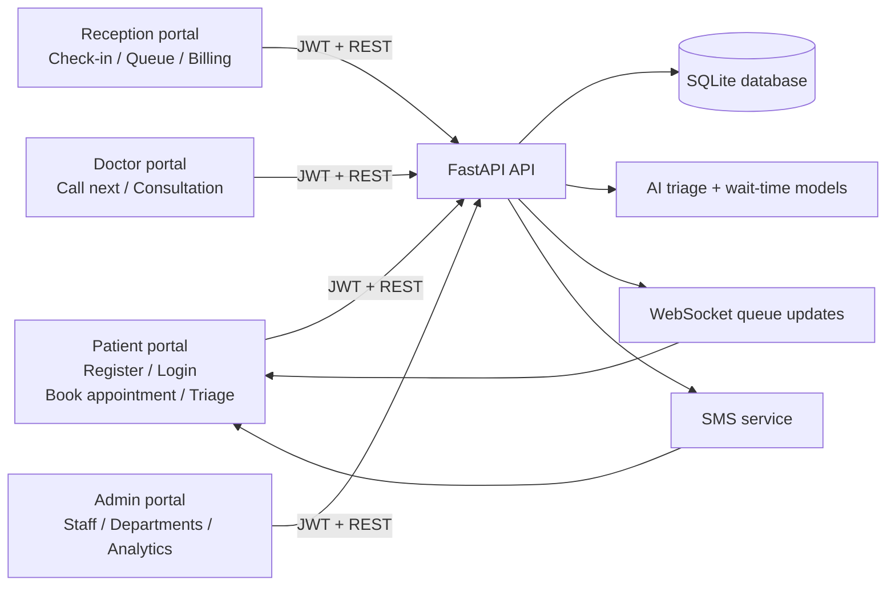
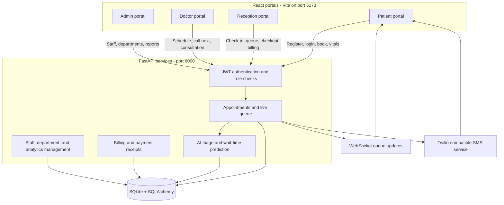

# 🏥 SmartQueue — AI-Powered Hospital Queue Management System

> An intelligent hospital queue management system with real-time triage prioritization, IoT-based vitals monitoring, SMS notifications, and multilingual support.

---

## 🚀 Features

| Feature | Description |
|---------|-------------|
| 🤖 **AI Triage** | Symptoms + Vitals → Risk Score (0–100) → Auto Priority |
| 📊 **Live Queue** | Real-time WebSocket queue updates |
| 📱 **SMS Alerts** | "You're Next!" via Twilio |
| 🔔 **Screen Banner** | Green/Orange alert with beep sound |
| 📶 **SmartWatch BLE** | Bluetooth vitals auto-fill (optional) |
| 💳 **Bill Generation** | Consultation + Lab + Medicine charges |
| ⭐ **Patient Feedback** | Star rating after appointment |
| 🌐 **Tamil Language** | Full Tamil + English UI support |
| 🛡️ **Role-Based Auth** | Patient / Doctor / Reception / Admin dashboards |

## Registration and Staff Accounts

Public registration creates **patient accounts only**. Doctor and reception accounts are created by an admin so staff permissions cannot be self-assigned. Use the **Register** tab on the login page to create a patient account; successful registration signs the patient in and opens the patient dashboard.

## Portal Diagram



---

## 🧰 Tech Stack

| Layer | Technology |
|-------|-----------|
| Frontend | React 18 + Vite |
| Backend | FastAPI + Python |
| Database | SQLite + SQLAlchemy |
| Auth | JWT + bcrypt |
| Real-time | WebSocket |
| SMS | Twilio |
| Charts | Chart.js |
| IoT | Web Bluetooth API |

---

## 📁 Project Structure

```
smart-hospital-queue/
├── frontend/          # React + Vite frontend
│   ├── src/
│   │   ├── pages/     # Patient, Doctor, Admin dashboards
│   │   ├── components/# Reusable components
│   │   ├── context/   # Auth context
│   │   └── api.js     # Axios API calls
│   └── vite.config.js
├── backend/           # FastAPI backend
│   └── app/
│       ├── routers/   # auth, patients, doctors, admin, billing, feedback
│       ├── ai/        # Triage AI + Wait Time Model
│       ├── utils/     # WebSocket + SMS service
│       ├── models.py  # SQLAlchemy DB models
│       └── main.py    # FastAPI app entry
├── START_PROJECT.bat  # One-click launcher (Windows)
└── README.md
```

---

## ⚡ Quick Start

### Prerequisites
- Python 3.10+
- Node.js 18+
- Git

### 1. Clone the repository
```bash
git clone https://github.com/YOUR_USERNAME/smart-hospital-queue.git
cd smart-hospital-queue
```

### 2. Backend Setup
```bash
cd backend
python -m venv venv
venv\Scripts\activate        # Windows
pip install -r requirements.txt
```

### 3. Frontend Setup
```bash
cd frontend
npm install
```

### 4. Run the Project
```bash
# Windows — just double-click:
START_PROJECT.bat

# OR manually:
# Terminal 1 (Backend)
cd backend && python -m uvicorn app.main:app --reload --host 127.0.0.1 --port 8000

# Terminal 2 (Frontend)
cd frontend && npm run dev -- --host 127.0.0.1 --port 5173
```

### 5. Open Browser
```
http://127.0.0.1:5173
```

---

## 🔑 Demo Login Credentials

| Role | Email | Password |
|------|-------|----------|
| Admin | admin@hospital.com | Admin@123 |
| Doctor | arjun.ramesh@hospital.com | Doctor@123 |
| Reception | reception@hospital.com | Reception@123 |
| Patient | rahul.gupta@email.com | Patient@123 |

---

## 📱 SMS Setup (Optional)

To enable real SMS notifications:
1. Create a [Twilio](https://twilio.com) account
2. Create `.env` file in `backend/`:
```env
SMS_ENABLED=true
TWILIO_ACCOUNT_SID=your_sid
TWILIO_AUTH_TOKEN=your_token
TWILIO_PHONE_NUMBER=+1234567890
```

> Without `.env`, the system runs in **demo mode** — SMS messages are logged to console.

---

## 🏗️ Architecture



---

## 📊 Demo Flow

### 1. Patient registration and booking

1. Open the login page and select **Register**.
2. Create a patient account with name, email, password, and optional health details.
3. Sign in automatically and choose a department, doctor, and appointment slot.
4. Submit symptoms and vitals for AI triage.
5. The system calculates priority and predicted wait time, then adds the appointment to the queue.

### 2. Reception desk workflow

1. Sign in with the reception account.
2. Search for the appointment or patient and confirm check-in.
3. Monitor the live queue and current consultation status.
4. After the consultation, confirm checkout and open the generated bill.
5. Collect cash, UPI, or card payment and print/download the receipt.

### 3. Doctor consultation workflow

1. Sign in to the doctor portal and review today's queue.
2. Select **Call Next** to move the highest-priority eligible patient into consultation.
3. The patient receives a queue update and optional SMS notification.
4. Complete or reject the appointment with the consultation outcome.

### 4. Admin management workflow

1. Sign in to the admin portal.
2. Create departments, doctor accounts, and reception accounts.
3. Review queue activity, emergency alerts, staff availability, and analytics.
4. Manage the hospital configuration without exposing staff roles to public registration.

---

## 👨‍💻 Developed By

**Sabari** — AI-Powered Smart Hospital Queue Management System  
📅 2026

---

## 📄 License

MIT License — Free to use for academic and educational purposes.
